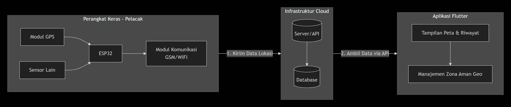

#  GPS Pet Tracker App

Aplikasi pelacakan GPS real-time untuk hewan peliharaan menggunakan **ESP32**, **Node.js**, dan **Flutter**.

---

##  Daftar Isi

- [Arsitektur Sistem](#-arsitektur-sistem)
- [Alur Pengembangan](#-alur-pengembangan)
- [Komponen](#-komponen)
- [Struktur Proyek](#-struktur-proyek)
- [Backend Server](#-backend-server)
- [ESP32 Hardware](#-esp32-hardware)
- [Aplikasi Flutter](#-aplikasi-flutter)
- [API Reference](#-api-reference)
- [Deployment ke Railway](#-deployment-ke-railway)
- [Troubleshooting](#-troubleshooting)

---

##  Arsitektur Sistem



Sistem terdiri dari 3 komponen utama:

| Komponen | Fungsi |
|----------|--------|
| **Perangkat Keras (ESP32 + GPS)** | Membaca koordinat GPS dan mengirim ke server |
| **Infrastruktur Cloud (Server/API)** | Menerima, menyimpan, dan menyediakan data lokasi |
| **Aplikasi Flutter** | Menampilkan peta, riwayat, dan manajemen geofence |

### Alur Data

```
1. ESP32 + GPS Neo-6M membaca koordinat latitude/longitude
2. Data dikirim ke Server via HTTP POST (WiFi/GSM)
3. Server menyimpan ke Database
4. Flutter App mengambil data via REST API
5. Lokasi ditampilkan di peta secara real-time
```

---

##  Alur Pengembangan


| Step | Tahapan | Deskripsi |
|------|---------|-----------|
| 1 | **Persiapkan Project Express** | Setup Node.js + Express server |
| 2 | **Integrasikan & Uji Database** | Buat endpoint API dan test CRUD |
| 3 | **Deploy ke Railway** | Upload server ke cloud hosting |
| 4 | **Siapkan Koneksi Flutter & ESP** | Update URL di app dan hardware |

---

##  Komponen

| Komponen | Teknologi | Deskripsi |
|----------|-----------|-----------|
| Hardware | ESP32 + Neo-6M GPS | Mikrokontroler dengan modul GPS |
| Backend | Node.js + Express | REST API server |
| Database | JSON File Storage | Penyimpanan data lokasi |
| Frontend | Flutter | Aplikasi mobile cross-platform |
| Hosting | Railway.sh | Cloud hosting untuk backend |

---

##  Struktur Proyek

```
pet_tracker_app/
│
├── 📂 server/                    # Backend Node.js
│   ├── index.js                 # Express server & API endpoints
│   ├── database.js              # Fungsi baca/tulis JSON
│   ├── package.json             # Dependencies (express, cors)
│   └── data.json                # File penyimpanan data (auto-generated)
│
├── 📂 hardware/                  # Kode ESP32 Arduino
│   ├── pet_tracker.ino          # Program utama ESP32
│   └── README.md                # Panduan pemasangan hardware
│
├── 📂 image/                     # Gambar dokumentasi
│   ├── arsitektur.png           # Diagram arsitektur sistem
│   └── backend.png              # Alur pengembangan backend
│
├── 📂 lib/                       # Flutter App
│   ├── main.dart                # Entry point aplikasi
│   ├── 📂 screens/
│   │   ├── gps_map_page.dart    # Halaman peta GPS real-time
│   │   ├── home_page.dart       # Dashboard utama
│   │   └── ...
│   └── 📂 services/
│       ├── location_service.dart # Service untuk API lokasi
│       └── ...
│
└── README.md                     # Dokumentasi ini
```

>  Lokasi folder `image/`, `server/`, dan `hardware/` sudah **BENAR** di root project.

---

##  Backend Server

### Instalasi

```bash
cd server
pnpm install
```

### Menjalankan Server

```bash
pnpm start
```

**Output yang diharapkan:**
```
 Pet Tracker Server running on port 3000
 Ready to receive GPS data from ESP32
```

### Test API dengan cURL

```bash
# 1. Kirim data lokasi (simulasi dari ESP32)
curl -X POST http://localhost:3000/api/location \
  -H "Content-Type: application/json" \
  -d '{"lat": -6.2088, "lng": 106.8456, "battery": 85}'

# Response: {"success":true,"id":...,"message":"Lokasi tersimpan"}

# 2. Ambil lokasi terbaru
curl http://localhost:3000/api/location/latest

# 3. Ambil riwayat lokasi (10 data terakhir)
curl http://localhost:3000/api/location/history?limit=10
```

---

##  ESP32 Hardware

### Komponen yang Dibutuhkan

| Komponen | Jumlah | Harga Estimasi |
|----------|--------|----------------|
| ESP32 DevKit V1 | 1 | Rp 50.000 |
| Neo-6M GPS Module | 1 | Rp 40.000 |
| Kabel Jumper | 4 | Rp 5.000 |
| Breadboard | 1 | Rp 15.000 |

### Diagram Koneksi

```
┌─────────────┐          ┌─────────────┐
│  GPS Neo-6M │          │    ESP32    │
├─────────────┤          ├─────────────┤
│ VCC ────────┼──────────┤ 3.3V        │
│ GND ────────┼──────────┤ GND         │
│ TX  ────────┼──────────┤ GPIO 16     │
│ RX  ────────┼──────────┤ GPIO 17     │
└─────────────┘          └─────────────┘
```

### Library yang Diperlukan

1. Buka **Arduino IDE**
2. Sketch → Include Library → Manage Libraries
3. Cari dan install: **TinyGPS++** by Mikal Hart

### Konfigurasi Kode

Edit file `hardware/pet_tracker.ino`:

```cpp
// ========== WAJIB DIGANTI ==========

// WiFi credentials
const char* ssid = "NAMA_WIFI_ANDA";
const char* password = "PASSWORD_WIFI_ANDA";

// Server URL (ganti setelah deploy ke Railway)
const char* serverUrl = "https://YOUR-APP.railway.app/api/location";
```

### Upload ke ESP32

1. Sambungkan ESP32 ke komputer via USB
2. Arduino IDE → Tools → Board → **ESP32 Dev Module**
3. Arduino IDE → Tools → Port → Pilih port COM yang sesuai
4. Klik **Upload** (⬆️)
5. Buka **Serial Monitor** (115200 baud)

---

##  Aplikasi Flutter

### Instalasi Dependencies

```bash
flutter pub get
```

### Konfigurasi URL Server

Edit file `lib/services/location_service.dart`:

```dart
class LocationService extends ChangeNotifier {
  // Untuk testing lokal
  static const String baseUrl = 'http://localhost:3000';
  
  // Untuk production (uncomment setelah deploy)
  // static const String baseUrl = 'https://YOUR-APP.railway.app';
}
```

### Menjalankan Aplikasi

```bash
# Web (Chrome)
flutter run -d chrome

# Android
flutter run -d android

# iOS
flutter run -d ios
```

### Fitur Aplikasi

| Fitur | Deskripsi |
|-------|-----------|
| 🗺️ Peta Real-time | Lokasi pet ditampilkan dengan marker animasi |
| 📍 Koordinat Live | Latitude & Longitude ter-update otomatis |
| 🔋 Status Baterai | Persentase baterai tracker |
| 🔄 Auto-refresh | Polling data setiap 5 detik |
| ✅ Status Koneksi | Indikator Live / Error / Connecting |

---

## 📡 API Reference

### Base URL

| Environment | URL |
|-------------|-----|
| Development | `http://localhost:3000` |
| Production | `https://YOUR-APP.railway.app` |

### Endpoints

#### `POST /api/location`
Menyimpan data lokasi dari ESP32.

**Request:**
```json
{
  "lat": -6.2088,
  "lng": 106.8456,
  "battery": 85,
  "device_id": "pet-tracker-001"
}
```

**Response:**
```json
{
  "success": true,
  "id": 1234567890,
  "message": "Lokasi tersimpan"
}
```

---

#### `GET /api/location/latest`
Mengambil lokasi terbaru.

**Response:**
```json
{
  "id": 1234567890,
  "device_id": "pet-tracker-001",
  "latitude": -6.2088,
  "longitude": 106.8456,
  "battery": 85,
  "timestamp": "2025-12-17T09:00:00.000Z"
}
```

---

#### `GET /api/location/history?limit=50`
Mengambil riwayat lokasi.

---

#### `POST /api/geofence`
Menambahkan zona aman.

---

#### `GET /api/geofence`
Mengambil daftar geofence.

---

##  Deployment ke Railway

### Step 1: Install Railway CLI

```bash
npm install -g @railway/cli
```

### Step 2: Login & Deploy

```bash
cd server
railway login
railway init
railway up
```

### Step 3: Dapatkan URL

Setelah deploy, Railway akan memberikan URL seperti:
```
https://pet-tracker-server-production.up.railway.app
```

### Step 4: Update URL di Kode

1. **Flutter** (`lib/services/location_service.dart`):
   ```dart
   static const String baseUrl = 'https://YOUR-APP.railway.app';
   ```

2. **ESP32** (`hardware/pet_tracker.ino`):
   ```cpp
   const char* serverUrl = "https://YOUR-APP.railway.app/api/location";
   ```

---

##  Troubleshooting

| Masalah | Penyebab | Solusi |
|---------|----------|--------|
| GPS tidak dapat sinyal | Indoor / tertutup | Bawa ke outdoor, tunggu 1-3 menit |
| WiFi tidak konek | SSID/password salah | Cek kredensial di kode ESP32 |
| API error 404 | Server belum jalan | Pastikan `node index.js` sudah running |
| Flutter CORS error | Browser blocking | Jalankan Chrome dengan `--disable-web-security` |
| Upload ESP32 gagal | Port tidak terdeteksi | Tekan tombol BOOT saat upload |
| Data tidak terkirim | URL salah | Pastikan URL server sudah benar |

---

##  Catatan Penting

> ⚠️ **Untuk Production:**
> - Jangan lupa update URL Railway di Flutter dan ESP32
> - Pastikan GPS mendapat sinyal di outdoor
> - Test API terlebih dahulu sebelum upload kode ESP32

---

##  License

MIT License - Bebas digunakan untuk keperluan edukasi dan proyek pribadi.

---

**Dibuat untuk Tugas Web Praktik Semester 3** 🎓
